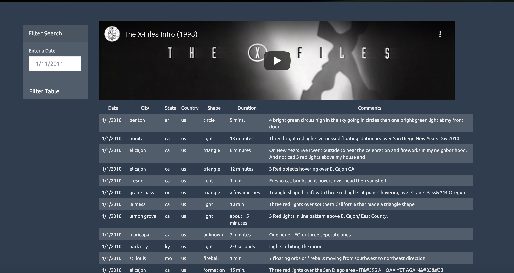
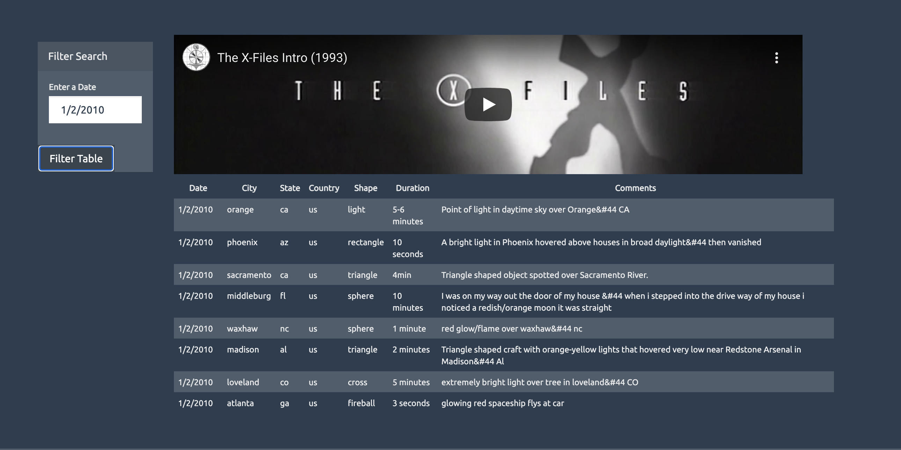

# JavaScript and DOM Manipulation

## Project Summary

* The goal of this project was to create an interactive website out of UFO sighting data with the following elements:
  * A form, where a date could be entered
  * A table that would respond to the entered date
* To achieve this goal, the Javascript library D3 was used to manipulate the HTML DOM.

## Technologies Used

* JavaScript - D3
* HTML
* CSS
* Bootstrap

## The Process

* A forEach loop was created (referencing the UFO sighting data). The loop appended each report and the data for each column: datetime, city, state, country, shape, durationMinutes, and comments. This forEach loop created the initial table with all the data.
* D3 was used to select the filter button and form. Based on these events, a runEnter function was created in order for a user to enter a date. The input value would then be used to generate a new table, using a nearly identical forEach loop as was used for the initial table. 

## The Final Product: An Interactive Webiste
* Table before input:
 
* Table after input:
 
